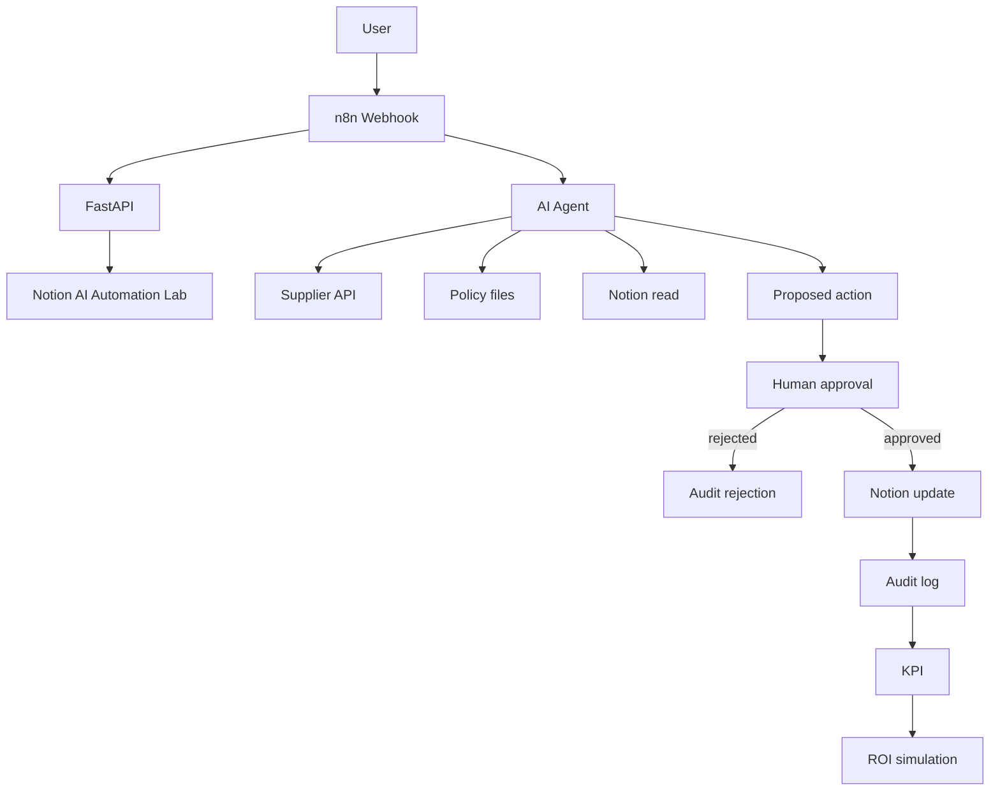

# OpsPilot

OpsPilot is a local AI operations assistant. A person sends an operational request. n8n orchestrates an LLM agent, the agent reads only the tools it is given, and nothing sensitive is written until a human approves it. Notion stores the business request. FastAPI exposes the supplier data, the policy files, the audit log, and a ROI simulation.

Supplier records and policy text in this repository are fictional demonstration data.

## Business problem

An operations team receives requests such as "ACME wants 90-day payment terms instead of 60." Someone has to find the supplier, read the policy, write a recommendation, and wait for approval. The repetitive reading can be prepared by an agent. The decision stays with a person.

## Demo scenario

Request:

> Analyse la demande du fournisseur ACME concernant ses conditions de paiement. Ils demandent 90 jours au lieu de 60.

Expected path:

1. The webhook checks the `X-OpsPilot-Webhook-Token` header, receives the request, and FastAPI assigns an id such as `REQ-2026-001`.
2. A Notion page is created with status `Processing`.
3. FastAPI finds the supplier named in the request (`POST /suppliers/match`). The workflow loads that record (ACME: 60 days, fictional demonstration data) and the payment-terms policy, then passes both to the agent. An unknown supplier, or two suppliers in one request, stops the run before the model is called: status `Failed`, with a message asking which supplier.
4. The agent returns a proposal. A change above 15 days needs Procurement Director approval. It does not change any payment term. The supplier, policy, and Notion read tools stay attached. This demo loads the records first so the model answers instead of looping on tool calls.
5. The webhook response contains the analysis and an approval URL. Notion moves to `Waiting Approval`.
6. A human posts `approved` or `rejected` to that URL with the `X-OpsPilot-Approver-Token` header. Without a decision within 24 hours, the request is rejected.
7. Approval sets the Notion page to `Completed`. Rejection sets it to `Rejected` and does not apply the change.
8. `GET /audit/{request_id}` shows the trail. `GET /kpi` shows measured counts. `GET /roi` shows a labeled simulation.

## Architecture



n8n is the orchestration layer. FastAPI is the business adapter. The reason for each choice is in [ARCHITECTURE.md](ARCHITECTURE.md).

## Tech stack

- n8n 2.41.3, AI Agent node, webhook, Wait node
- FastAPI and Python 3.12
- PostgreSQL 16 for the audit log in Docker; SQLite for tests
- Notion API, one database created for this POC
- An OpenAI-compatible chat model configured in n8n
- Docker Compose
- GitHub Actions: ruff lint and format, tests on SQLite and PostgreSQL, API image build

Not used in this version: Syro, a vector database, MCP, Slack, a frontend, cloud deployment.

## Installation

Docker Desktop is required. Copy the environment file and edit it:

```powershell
Copy-Item .env.example .env
```

```bash
cp .env.example .env
```

Create a Notion integration and connect it only to one empty parent page. Put the token and that page id in `.env`, then create the database:

```powershell
python scripts/setup_notion.py
```

Copy the printed `NOTION_DATABASE_ID` into `.env`.

Stop the practice n8n container if it is already using port 5678:

```powershell
docker stop n8n
docker rm n8n
```

That container is separate from Compose. Compose uses its own volume.

## Environment variables

| Variable | Who reads it | Purpose |
| --- | --- | --- |
| `LLM_API_KEY` | You, in the n8n credential screen | Model provider key. Not injected into containers. |
| `LLM_MODEL` | n8n | Model id, default `gpt-4o-mini`. |
| `NOTION_API_KEY` | FastAPI | Integration token for the POC database only. |
| `NOTION_PARENT_PAGE_ID` | `scripts/setup_notion.py` | Parent of the new database. |
| `NOTION_DATABASE_ID` | FastAPI | Database created by the setup script. |
| `INTERNAL_API_TOKEN` | n8n and FastAPI | Local token on the API calls. |
| `OPSPILOT_WEBHOOK_TOKEN` | You, in the n8n credential screen, and the requester | Value of `X-OpsPilot-Webhook-Token` on the intake webhook. |
| `OPSPILOT_APPROVER_TOKEN` | You, in the n8n credential screen, and the approver | Value of `X-OpsPilot-Approver-Token` on the approval URL. Keep it different from the webhook token. |
| `POSTGRES_PASSWORD` | Postgres and FastAPI | Local database password. |
| `DATABASE_URL` | FastAPI outside Compose | Overridden inside Compose. |
| `N8N_ENCRYPTION_KEY` | n8n | Keeps credentials stable across restarts. |
| `SUPPLIER_API_URL` | Documentation | Base URL of this API. |

## How to run

From this folder, with `.env` present:

```powershell
docker compose up --build
```

- n8n: http://localhost:5678
- API health: http://localhost:8080/health

On the first n8n screen, create a local owner account. It is not an n8n Cloud account.

Then, in n8n:

1. Create an OpenAI credential with `LLM_API_KEY`. The workflow node is the OpenAI chat model. Swapping that node is how you use Anthropic or Mistral instead.
2. Create a **Header Auth** credential named `OpsPilot Webhook Token`: header name `X-OpsPilot-Webhook-Token`, value `OPSPILOT_WEBHOOK_TOKEN`.
3. Create a second **Header Auth** credential named `OpsPilot Approver Token`: header name `X-OpsPilot-Approver-Token`, value `OPSPILOT_APPROVER_TOKEN`.
4. Import `n8n/opspilot-workflow.json`.
5. Select the OpenAI credential on **OpenAI Chat Model**, `OpsPilot Webhook Token` on **Webhook**, and `OpsPilot Approver Token` on **Wait for Human Approval**.
6. Activate **OpsPilot — AI Operations Workflow**.

## How to test

Automated:

```powershell
python -m pip install -r api/requirements.txt -r api/requirements-dev.txt
python -m pytest
```

Manual, after Compose is up and the workflow is active. In PowerShell, call `curl.exe`, not `curl`.

### Test 1 — normal request

```powershell
curl.exe -X POST http://localhost:5678/webhook/opspilot `
  -H "X-OpsPilot-Webhook-Token: <OPSPILOT_WEBHOOK_TOKEN>" `
  -H "Content-Type: application/json" `
  -d "{\"request\":\"Analyse la demande du fournisseur ACME concernant ses conditions de paiement. Ils demandent 90 jours au lieu de 60.\",\"requester\":\"portfolio-user\"}"
```

Expected: supplier and policy are consulted, a proposal is returned, `approval_url` is present, `fallback_used` is `false`, Notion is `Waiting Approval`. No payment term is changed. Without the header, the webhook answers 403.

If `fallback_used` is `true`, the model reply was not valid JSON and the workflow built the proposal from the loaded records. `/kpi` counts these in `fallback_used_count`.

### Test 2 — rejected

Post this JSON to `approval_url`, with the approver header:

```powershell
curl.exe -X POST "<approval_url>" `
  -H "X-OpsPilot-Approver-Token: <OPSPILOT_APPROVER_TOKEN>" `
  -H "Content-Type: application/json" `
  -d "{\"decision\":\"rejected\",\"approved_by\":\"portfolio-user\"}"
```

Expected: Notion becomes `Rejected`. The audit execution status is `rejected`. The request is not `Completed`.

### Test 3 — approved

Use a new webhook call, then post the same way:

```json
{"decision":"approved","approved_by":"portfolio-user"}
```

Without the approver header, or with the webhook token in its place, the approval URL answers 403 and the request stays `Waiting Approval`.

Expected: Notion becomes `Completed`, the analysis and proposed action are on the page, and the audit execution status is `completed`.

### Test 4 — API unavailable

Stop the API container and send the webhook again.

```powershell
docker stop opspilot-api-1
```

The Compose service name is `api`; the container name is usually `opspilot-api-1`.

Expected: the HTTP nodes retry, then the webhook returns `Failed`. No request is marked `Completed`.

```powershell
docker start opspilot-api-1
```

### Test 5 — unknown supplier

Send `Globex demande 90 jours au lieu de 60.` to the webhook.

Expected: the webhook returns `Failed` with `No known supplier is named in the request. Ask the requester which one.` The model is not called. The request is `Failed` in `/audit/{request_id}`.

KPI and ROI, from the host:

```powershell
curl.exe -H "X-OpsPilot-Token: change-me-local-only" http://localhost:8080/kpi
curl.exe -H "X-OpsPilot-Token: change-me-local-only" http://localhost:8080/roi
python scripts/roi.py
```

Replace the token if you changed `INTERNAL_API_TOKEN`.

## Example workflow

The importable workflow is [n8n/opspilot-workflow.json](n8n/opspilot-workflow.json).

Webhook → Normalize Request → Create Notion Request → Load System Prompt → Load Supplier → Load Policy → AI Agent → Prepare Proposal → Record Proposal → Respond With Proposal → Wait for Human Approval → Approved? → Execute Approved Action or Record Rejection.

The agent tools are Supplier API Tool, Policy Tool, and Notion Read Tool. The system prompt is loaded from `prompts/opspilot_system.md` through `GET /prompts/system`, so the file in git is the copy the agent receives.

## Security considerations

Details and the risks that are still open are in [SECURITY.md](SECURITY.md).

Short version: keys stay in `.env` or in the n8n credential store. The Notion token is limited to the POC page. The webhook and the approval URL each need their own header token. Write completion happens only after the Wait node. Tool output is marked untrusted. The audit log records the decision and the outcome.

## ROI methodology

The calculation is a simulation. The label returned by the API is `Simulation based on configurable assumptions.` Assumptions live in [config/roi_assumptions.json](config/roi_assumptions.json). The formulas are in [docs/roi.md](docs/roi.md).

Measured counts come from `/kpi`. They are not mixed into the monthly euro figures. Those euro figures use `requests_per_month` from the assumptions file.

## Limitations

- The human gate is an n8n Wait webhook, not a product UI.
- The executed action updates the Notion request. It does not call an ERP.
- The webhook and the approval URL are protected by shared header tokens, not user accounts. `approved_by` is what the approver types. Compose publishes both ports on 127.0.0.1 only.
- FastAPI trusts n8n once the internal token matches. The token is a local demo value.
- Policy search is keyword overlap, not retrieval with embeddings.
- LLM calls are not retried, because each retry costs money. Notion and HTTP calls are retried a bounded number of times.
- Syro, MCP, Slack, and cloud deployment are not implemented.

## Roadmap

- Replace the keyword policy tool with an HTTP call to a retrieval API, without changing the agent contract.
- Move the three tools behind an MCP server once more than one agent needs them.
- Add Slack as a second approval channel in front of the same Wait contract.
- Deploy the Compose stack only after the internal token and the Notion token are real secrets.
